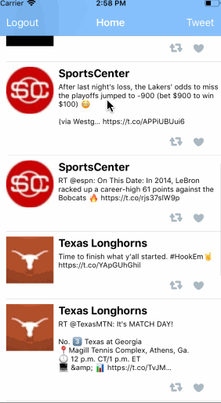
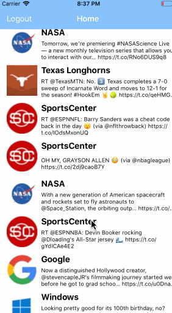

# Twitter Replica

This is a basic twitter app to view, compose, favorite, and retweet tweets.

## User Stories

- [x] User can compose a tweet. 
- [x] User can favorite a tweet.  
- [x] User can retweet a tweet.  

## Additional User Stories

- [x] User sees app icon in home screen and styled launch screen. 
- [x] User can log in.  
- [x] User can log out.  
- [x] User stays logged in across restarts.  
- [x] User can view tweets with the user profile picture, username, and tweet text. 
- [x] User can pull to refresh.  
- [x] User can load past tweets infinitely.  

## Video Walkthrough

Here's a walkthrough of implemented user stories:

## License

    Copyright [2019] [Jason Stephen]

    Licensed under the Apache License, Version 2.0 (the "License");
    you may not use this file except in compliance with the License.
    You may obtain a copy of the License at

        http://www.apache.org/licenses/LICENSE-2.0

    Unless required by applicable law or agreed to in writing, software
    distributed under the License is distributed on an "AS IS" BASIS,
    WITHOUT WARRANTIES OR CONDITIONS OF ANY KIND, either express or implied.
    See the License for the specific language governing permissions and
    limitations under the License.# tipCalculator
